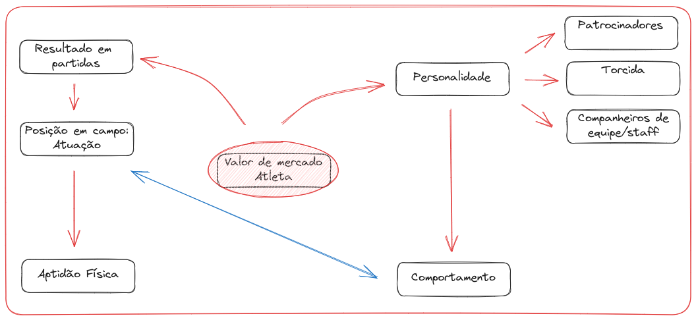
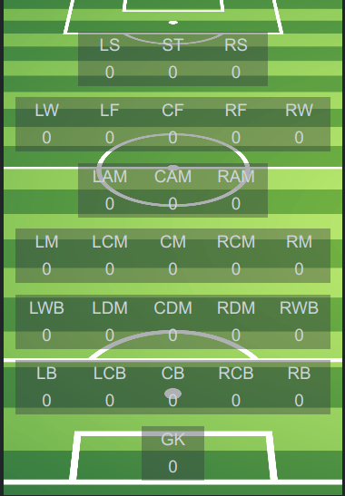
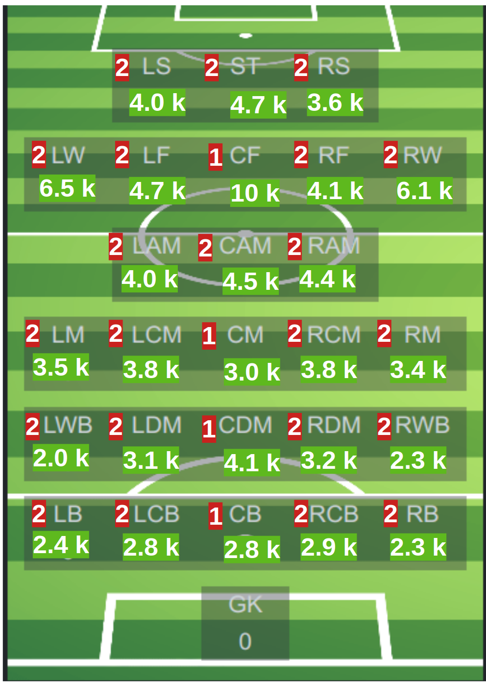

```{r setup, include=FALSE}
knitr::opts_chunk$set( echo = TRUE )
```
_Disclaimer:_ Todos os cenários, descrições, e situações deste projeto são fictícios e não representam qualquer relação com alguma empresa real. Portanto, os processos, resultados, recomendações, ou qualquer outra informação presente neste projeto possuem a única intenção de descrever minhas habilidades em ciência de dados. Os dados utilizados neste projeto foram coletados de um domínio público do website [Kaggle](https://www.kaggle.com/datasets/stefanoleone992/fifa-22-complete-player-dataset). Esta base de dados está em domínio público e sua utilização respeita todos os termo e condições do website.

# **0.0 INTRODUÇÃO**  

## **0.1 Contexto do projeto**  

**A empresa**  

**GoalForce Analytics** é uma empresa que avalia jovens jogadores de futebol, visando detectar indicadores que demonstrem potencial de sucesso dos mesmos.  

## **0.2 Problema de negócio**  

O CEO da **GoalForce Analytics** requisitou a equipe de cientistas de dados uma solução do tipo insights que orientasse qual posição de atuação no clube o jogador deveria investir, visando retorno financeiro para um jovem jogador de futebol.

## **0.3 Planejamento da Solução**  

Para entregar o produto final, solicitado pelo CEO da empresa, existem algum passos que o cientista de dados deve percorrer, que incluem:  

* Estabelecimento do problema a ser resolvido;  
* Entendimento do negócio e mapeamento das premissas;  
* Coleta, processamento, e analise dos dados;  
* Implementação de análise detalhada, e avaliação dos resultados;
* Apresentar um relatório simples e eficiente, onde os _stakeholders_ poderão tomas suas decisões baseado em dados.  

**Ferramentas utilizadas**  

A justificativa para utilização da linguagem R se deu pelo planejamento para os próximos ciclos deste projeto. Para o primeiro ciclo, a abordagem do projeto será do tipo insights. Para o ciclo 2 em diante, será feita uma abordagem de rergessão, utilizando modelagem linear mista. A linguagem R já possui ferramentas desenvolvidas para realizar tais técnicas. Além disso, devido ao planejamento dos ciclos, optei por já iniciar o projeto no R, uma vez que o mesmo também possui boas ferramentas de manipulação e visualização de dados.

* Linguagem de programação R
* Bibliotecas de manipulação e visualização de dados

# **1.0 PREMISSAS**  

Após estudo detalhado do pedido do CEO, algumas premissas devem ser levadas em consideração. Abaixo encontra - se as premissas consideradas para este projeto:  

{width=600}

# **1.1 Desenvolvimento da solução**  

## **1.2. Coleta de dados**  

Os dados para esse projeto foram coletados no site Kaggle. As informações de jogadores de futebol profissionais de oito temporadas estão cadastrados no jogo FIFA do estúdio EA Sports. Os dados utilizados se referem a um histórico dos jogadores no período, e apresentam características da aptidão física e abordagem técnico-tática dos mesmos. Embora se tratem de dados sintéticos, os atributos podem ser coletados em jogares no mundo real e os métodos de ciência de dados aqui implementados, podem ser aplicados no mundo real. Os dados podem ser baixados [aqui]('https://www.kaggle.com/datasets/stefanoleone992/fifa-22-complete-player-dataset').  

A página do Kaggle disponibiliza os dados em _links_ individuais, e os arquivos estão em formato .csv, formatados como tabelas e disponíveis para _download_. O autor dos conjuntos de dados afirma que os dados são oriundos de procedimento de _webscraping_, o que sugere que possíveis vieses seriam oriundos dos códigos utilizados na coleta de dados.  

Os dados utilizados respeitam os termos de utilização do Kaggle. Os dados foram armazenados em maquina local e protegidos por senha. Após download, eu realizei rápida inspeção visual, procurando por problemas visíveis, para preparar os dados para processamento e análise. Este cuidado inicial dom os dados visa ampliar a qualidade das análises e interpretação dos resultados.  

### **1.2.1. Bibliotecas**  
Para carregar os dados no ambiente de trabalho bem como desenvolver todos os procedimentos do projeto, será necessário carregar algumas bibliotecas que não são nativas no R.  

```{r}
library( readxl )
library( dplyr )
library( ggplot2 )
library( reshape2 )
library( psych )
library( knitr )
library( pander )
library( kableExtra )
library( stringr )
```

### **1.2.2. Carregando os dados**  

Os dados deste projeto foram disponibilizados em arquivos separados (possivelmente, devido ao tamanho de cada arquivo. Também, arquivos separados facilitam a análise de diferentes temporadas sem a necessidade de linhas de código adicionais).  

Para carregar os dados, primeiro eu listei todos os arquivos .csv no ambiente de trabalho:

```{r}
csv_files <- list.files( pattern = "*.csv" )
```

Então, carreguei e nomeei cada arquivo de acordo com a temporada que o mesmo representa:

```{r}
data_list <- list()

for ( file in csv_files ){
  #extract the file name without the extension
  file_name <- gsub( "\\.csv", "", file, ignore.case=TRUE )
  
  # Load csv into data frame
  df <- read.csv( file, header=TRUE )
  
  #  assign the data frame to an object with the same name
  assign( file_name, df )
  
  #add the data frame to the list
  data_list[[file_name]] <- df
}

```

Em seguida, criei uma lista com todos os data frames do ambiente, realizei pequena correção nos tipos de dados nas variáveis "lw" e "rw" para poder concatenar todos os data frames em um único arquivo. o último bloco de códigos na célula abaixo removou aqueles arquivos que não serão mais utilizados, visando liberar recursos do computador local:  

```{r}
# get a list of all data frames in the environment
df_list <- Filter( is.data.frame,mget( ls() ) )

# fix data types for concatenation
fifa_17$lw <- as.character( fifa_17$lw )
fifa_18$lw <- as.character( fifa_18$lw )
fifa_21$lw <- as.character( fifa_21$lw )
fifa_22$lw <- as.character( fifa_22$lw )

fifa_17$rw <- as.character( fifa_17$rw )
fifa_21$rw <- as.character( fifa_21$rw )
fifa_22$rw <- as.character( fifa_22$rw )

# concatenate all data frames into single data frame
fifa_15to20 <- bind_rows( fifa_15,fifa_16,fifa_17,fifa_18,fifa_19,fifa_20 )
fifa_rest <- bind_rows( fifa_15to20,fifa_21 )

fifas <- bind_rows( fifa_rest,fifa_22 )

# remove unused data
rm( fifa_15,fifa_16,fifa_17,fifa_18,fifa_19,fifa_20,fifa_21,fifa_22,fifa_15to20,fifa_rest, fifa_rkd, data_list, df, df_list, file, file_name, csv_files )
```

#### **1.2.2.1 Análise descritiva**  

Neste passo, serão feitas descrição dos atributos do conjunto de dados, verificação da dimensão do data frame com as oito temporadas, verificados os tipos de variáveis, se existem dados faltantes, e realizar uma análise estatística descritiva.  

Tabela 1. Descrição dos atributos do data frame original.

| var_name	                    | description                                                                                      |
|:------------------------------|:------------------|
| sofifa_id	                    | unique player ID on sofifa                                                                       |
| player_url	                | URL of the scraped player                                                                        |
| short_name	                | player short name|
| long_name	                    | player long name|
| player_positions	            | player preferred positions|
| overall	                    | player current overall attribute|
| potential	                    | player potential overall attribute|
| value_eur	                    | player value (in EUR)|
| wage_eur	                    | player weekly wage (in EUR)|
| age	                        | player age|
| dob	                        | player date of birth|
| height_cm	                    | player height (in cm)|
| weight_kg	                    | player weight (in kg)|
| club_team_id	                | club team_id on sofifa where the player plays|
| club_name	                    | club name where the player plays|
| league_name	                | league name of the club|
| league_level	                | league rank of the club (e.g. English Premier League is 1, English League Championship is 2, etc.)| 
| club_position	                | player position in the club (e.g. SUB means substitute, RES means reserve) |
| club_jersey_number	        | player jersey number in the club |
| club_loaned_from	            | club loaning out the player - if applicable |
| club_joined	                | date when the player joined his current club |
| club_contract_valid_until	    | player contract expiration date |
| nationality_id	            | player nationality id on sofifa |
| nationality_name	            | player nationality name |
| nation_team_id	            | national team_id on sofifa where the player plays |
| nation_position	            | player position in the national team |
| nation_jersey_number	        | player jersey number in the national team |
| preferred_foot	            | player preferred foot |
| weak_foot	                    | player weak foot attribute |
| skill_moves	                | player skill moves attribute |
| international_reputation	    | player international reputation attribute |
| work_rate	                    | player work rate attributes (attacking / defensive) |
| body_type	                    | player body type |
| real_face	                    | player real face |
| release_clause_eur	        | player release clause (in EUR) - if applicable |
| player_tags	                | player tags |
| player_traits	                | player traits |
| pace	                        | player pace attribute |
| shooting	                    | player shooting attribute |
| passing	                    | player passing attribute |
| dribbling	                    | player dribbling attribute |
| defending	                    | player defending attribute |
| physic	                    | player physic attribute |
| attacking_crossing	        | player crossing attribute |
| attacking_finishing	        | player finishing attribute |
| attacking_heading_accuracy	| player heading accuracy attribute |
| attacking_short_passing	    | player short passing attribute |
| attacking_volleys	            | player volleys attribute |
| skill_dribbling	            | player dribbling attribute |
| skill_curve	                | player curve attribute |
| skill_fk_accuracy	            | player free-kick accuracy attribute |
| skill_long_passing	        | player long passing attribute |
| skill_ball_control	        | player ball control attribute |
| movement_acceleration	        | player acceleration attribute |
| movement_sprint_speed	        | player sprint speed attribute |
| movement_agility	            | player agility attribute |
| movement_reactions	        | player reactions attribute |
| movement_balance	            | player balance attribute |
| power_shot_power	            | player shot power attribute |
| power_jumping	                | player jumping attribute |
| power_stamina	                | player stamina attribute |
| power_strength	            | player strength attribute |
| power_long_shots	            | player long shots attribute |
| mentality_aggression	        | player aggression attribute |
| mentality_interceptions	    | player interceptions attribute |
| mentality_positioning	        | player positioning attribute |
| mentality_vision	            | player vision attribute |
| mentality_penalties	        | player penalties attribute |
| mentality_composure	        | player composure attribute |
| defending_marking_awareness	| player marking awareness attribute |
| defending_standing_tackle	    | player standing tackle attribute |
| defending_sliding_tackle	    | player sliding tackle attribute |
| goalkeeping_diving	        | player GK diving attribute |
| goalkeeping_handling	        | player GK handling attribute |
| goalkeeping_kicking	        | player GK kicking attribute |
| goalkeeping_positioning	    | player GK positioning attribute |
| goalkeeping_reflexes	        | player GK reflexes attribute |
| goalkeeping_speed	            | player GK speed attribute |
| ls	                        | player attribute playing as LS – left striker |
| st	                        | player attribute playing as ST – striker, or centre forward |
| rs	                        | player attribute playing as RS – right striker |
| lw	                        | player attribute playing as LW – left winger |
| lf	                        | player attribute playing as LF – left forward |
| cf	                        | player attribute playing as CF – centre forward or central forward |
| rf	                        | player attribute playing as RF – right forward |
| rw	                        | player attribute playing as RW – right winger winger |
| lam	                        | player attribute playing as LAM – left attacking midfielder |
| cam	                        | player attribute playing as CAM – central attacking midfielder |
| ram	                        | player attribute playing as RAM – right attacking midfielder |
| lm	                        | player attribute playing as LM – left midfielder |
| lcm	                        | player attribute playing as LCM – left central midfielder |
| cm	                        | player attribute playing as CM – central midfielder |
| rcm	                        | player attribute playing as RCM – right central midfielder |
| rm	                        | player attribute playing as RM – right midfielder |
| lwb	                        | player attribute playing as LWB – left wing back |
| ldm	                        | player attribute playing as LDM - left defensive midfielder |
| cdm	                        | player attribute playing as CDM – central defensive midfielder |
| rdm	                        | player attribute playing as RDM – right defensive midfielder |
| rwb	                        | player attribute playing as RWB – right wing back |
| lb	                        | player attribute playing as LB – left back |
| lcb	                        | player attribute playing as LCB – left central back |
| cb	                        | player attribute playing as CB – central back |
| rcb	                        | player attribute playing as RCB – right central back |
| rb	                        | player attribute playing as RB – right back |
| gk	                        | player attribute playing as GK – goalkeeper |
| player_face_url	            | URL of the player face |
| club_logo_url	                | URL of the club logo |
| club_flag_url	                | URL of the club nationality flag |
| nation_logo_url	            | URL of the national team logo |
| nation_flag_url	            | URL of the national flag |

**Um ponto bastante interessante e importante deste projeto experimental é que os dados sintéticos aqui apresentados podem ser coletados no mundo real. Basta verificar alguns dos atributos que serão utilizados com maiores detalhes. Veja as descrições [aqui.](https://fifauteam.com/fc-24-attributes/)


Para este projeto, apenas alguns atributos serão utilizados para a elaboração do produto de dados final. Portanto, as variáveis abaixo serão removidas do conjunto de dados visando melhorar a clareza, bem como, a o desempenho geral do computador utilizado.  

```{r}
fifas <- subset(fifas, select = -c( sofifa_id                 , player_url           ,   
                                    club_team_id              , club_name            ,   
                                    league_name               , league_level         ,   
                                    club_loaned_from          , club_joined          ,   
                                    club_contract_valid_until , nationality_id       ,   
                                    nationality_name          , nation_team_id       ,   
                                    nation_position           , nation_jersey_number ,   
                                    real_face                 , release_clause_eur   ,   
                                    player_tags               , player_traits        ,   
                                    player_face_url           , club_logo_url        ,   
                                    club_flag_url             , nation_logo_url      ,   
                                    nation_flag_url           , international_reputation,
                                    mentality_aggression      , mentality_interceptions,
                                    mentality_positioning     , mentality_vision,
                                    mentality_penalties       , mentality_composure,
                                    goalkeeping_speed         , club_jersey_number,
                                    work_rate                 , body_type,
                                    ls                        , st,
                                    rs                        , lw,
                                    lf                        , cf,
                                    rf                        , rw,
                                    lam                       , cam,
                                    ram                       , lm, 
                                    lcm                       , cm,
                                    rcm                       , rm,
                                    lwb                       , ldm,
                                    cdm                       , rdm,
                                    rwb                       , lb,
                                    lcb                       , cb,
                                    rcb                       , rb,
                                    gk
                                    ))
```


### **1.2.3. Dimensão dos dados**  

Aqui, verifiquei a dimensão do data frame após concatenar todas as temporadas.  
```{r echo=FALSE}
cat("A base de dados contém:", dim(fifas)[1], " linhas e ", dim(fifas)[2], "colunas.")
```

### **1.2.4. Limpeza dos dados**  

A limpeza de dados compreende algumas etapas abrangentes para garantir a qualidade dos dados quando chegarmos à fase de modelagem. Estes são descritos abaixo:  

#### **1.2.4.1. Tipos de dados**  

```{r}
# Create a data frame with column index, name, and data type
column_info <- data.frame(
  Column_Index = 1:length(names(fifas)),
  Data_Type = sapply(fifas, typeof),
  stringsAsFactors = FALSE
)

# Print the table using kableExtra for styling
kable(column_info, align = "c") %>%
  kable_styling(full_width = FALSE, bootstrap_options = "striped", font_size = 14) %>%
  add_header_above(c(" " = 1, "Column Index" = 1, "Data Type" = 1), bold = TRUE) %>%
  row_spec(0, background = "white",color = "black") %>% 
  column_spec(1:3, color = "black")

```

#### **1.2.4.2. Checagem de dados faltantes (NA's)**

```{r}
# Remove rows from club_position empty cells
fifass <- subset(fifas, club_position != "")
fifas <- fifass
rm(fifass)

na_count <- sapply(fifas, function(x) sum(is.na(x)))

# Create a list with variable name - value format
na_count_list <- paste(names(na_count), na_count, sep = ": ")

# Print the list
print(na_count_list)
```

A **variável resposta** do projeto é a "value_eur", que apresenta 1897 dados faltantes. Dentro do contexto deste projeto, decidi remover os dados faltantes, uma vez que se trata de um primeiro ciclo, com dados experimentais.  

```{r}
cat("O conjunto de dados original contém", dim(fifas)[1], " linhas e", dim(fifas)[2], "colunas.")

fifas <- fifas[complete.cases(fifas$value_eur), ]

cat("Após remoção dos dados faltantes da variável resposta, o conjunto de dados agora tem", dim(fifas)[1], " linhas e", dim(fifas)[2], "colunas.")
```

Ainda, as variáveis "pace", "shooting", "passing", "dribbling", "defending", e "physic" apresentam  15791 dados faltantes. Estes também serão removidos. Vale ressaltar que todos os dados faltantes são correspondentes nas linhas. Portanto, remover os dados faltantes da variável "pace" automaticamente removerá o restante.    

```{r}
fifas <- fifas[complete.cases(fifas$pace), ]

cat('Após remoção dos dados faltantes das variáveis "pace", "shooting", "passing", "dribbling", "defending", e "physic", o conjunto de dados agora tem', dim(fifas)[1], " linhas e", dim(fifas)[2], "colunas.")
```

#### **1.2.4.3. Nova contagem de NA's e visualização da nova estrutura do conjunto de dados**  

```{r}
na_count <- sapply(fifas, function(x) sum(is.na(x)))

# Create a list with variable name - value format
na_count_list <- paste(names(na_count), na_count, sep = ": ")

# Print the list
print(na_count_list)

cat('A nova dimensão do conjunto de dados contém', dim(fifas)[1], "linhas e", dim(fifas)[2], "colunas.")
cat('')
```

#### **1.2.4.4. Formatação dos tipos de dados**  

Uma característica interessante na linguagem R é que ao chamar a função "head" para verificar as primeiras linhas do conjunto de dados, também é apresentado o tipo de variável. Tal característica auxilia na formatação do tipo de variável.

Abaixo, segue a formatação das variáveis.  

```{r}
fifas$dob <- as.Date(fifas$dob, format = "%Y-%m-%d")
head(fifas,3)
```


### **1.2.5. Estatística Descritiva**  

Para a realização da estatística descritiva geral, os dados serão separados em numéricos e não-numéricos.  

#### **1.2.5.1. Atributos Numéricos**  

No código abaixo, os dados numéricos serão separados dos não-numéricos:  

```{r}
options(scipen = 999)
df_num <- fifas[,sapply(fifas, is.numeric)]
round(t(describe(df_num)),2)
```

#### **1.2.5.2. Criando visualizações para verificar a distribuição dos dados numéricos**  

```{r}
df_num1 <- df_num[,1:22]
df_num2 <- df_num[,23:44]

# Melt the data frame to long format for plotting
df_num_melt1 <- melt(df_num1)

# Create a grid of histograms using ggplot2
ggplot(df_num_melt1, aes(x = value)) +
  geom_histogram() +
  facet_wrap(~ variable, nrow = 5, ncol = 5, scales = "free") +
  labs(x = "Value", y = "Count")
```

```{r}
df_num1 <- df_num[,1:22]
df_num2 <- df_num[,23:44]

# Melt the data frame to long format for plotting
df_num_melt2 <- melt(df_num2)

# Create a grid of histograms using ggplot2
ggplot(df_num_melt2, aes(x = value)) +
  geom_histogram() +
  facet_wrap(~ variable, nrow = 5, ncol = 5, scales = "free") +
  labs(x = "Value", y = "Count")
```

```{r}
df_num4 <- df_num[,1:11]
df_num5 <- df_num[,12:23]
df_num6 <- df_num[,24:35]
df_num7 <- df_num[,35:44]

# Melt the data frame to long format for plotting
df_num_melt4 <- melt(df_num4)
df_num_melt5 <- melt(df_num5)
df_num_melt6 <- melt(df_num6)
df_num_melt7 <- melt(df_num7)
```


```{r}
ggplot(df_num_melt4, aes(sample = value)) +
  geom_qq() +
  facet_wrap(~ variable, nrow = 3, ncol = 5, scales = "free") +
  labs(x = "Theoretical Quantiles", y = "Sample Quantiles")
```


```{r}
ggplot(df_num_melt5, aes(sample = value)) +
  geom_qq() +
  facet_wrap(~ variable, nrow = 3, ncol = 5, scales = "free") +
  labs(x = "Theoretical Quantiles", y = "Sample Quantiles")

```

```{r}
ggplot(df_num_melt6, aes(sample = value)) +
  geom_qq() +
  facet_wrap(~ variable, nrow = 3, ncol = 5, scales = "free") +
  labs(x = "Theoretical Quantiles", y = "Sample Quantiles")
```

```{r}
ggplot(df_num_melt7, aes(sample = value)) +
  geom_qq() +
  facet_wrap(~ variable, nrow = 3, ncol = 5, scales = "free") +
  labs(x = "Theoretical Quantiles", y = "Sample Quantiles")
```

```{r}
# Removing unnecessary files
rm(df_num,df_num1,df_num2,df_num3,df_num4,df_num5,df_num6,df_num7,df_num_melt1,df_num_melt2,df_num_melt3,df_num_melt4,df_num_melt5,df_num_melt6,df_num_melt7, column_info)
```


#### **1.2.5.3. Atributos Categóricos**  

O conjunto de dados também possui algumas variáveis categoricas, que foram separadas das variáveis numéricas para análise de pré-processamento e limpeza.  

```{r}
# Separate the non-numerical attributes of the original data frame.
df_cat <- fifas[,!sapply(fifas, is.numeric)]

# Show the first few rows for initial visual inspection.
head(df_cat)
```  

Note que as variáveis categóricas são apenas 6 (eu um universo de 51 variáveis).

# **2.0. FEATURE ENGINEERING**

A base de dado possui uma variável chamada "player_positions", que apresenta quais posições em campo o jogador pode atuar. Por exemplo, o jogador Luis Alberto Suárez Díaz pode atuar em duas posições: ST, CF. Por outro lado, existem jogadores que atuam em uma posição, ao passo que outros, em duas ou três. Portanto, criei uma variável que apresenta a contagem das possibilidades de posições em que o jogador pode participar para verificar o impacto desta versatilidade no valor final do jogador.  

```{r}
# CREATE A PLAYING POSITION COUNTING VARIABLE. THIS ONE WILL SHOW IN HOW MANY POSITIONS A PLAYER PLAYS.

fifas$p_position_count <- str_count(fifas$player_positions, ",") + 1

```  


## **2.1. Mapa de hipóteses**  

Este projeto visa estimar o valor de mercado de um jogador de futebol a partir de características facilmente quantificáveis. A base de dados disponível permite criar algumas hipóteses que serão ou não validadas para a elaboração do modelo de predição.  

{width=500}

## **2.2. Criando Hipoteses**  

H1. Valor médio do jogador depende da posição que o mesmo atua;
H2. Jogadores apresentam características distintas, de acordo com a posição que atuam;
H3. Jogadores versáteis são mais valiosos;
H4. Jogadores versáteis, dentro de sua faixa de atuação, são mais valiosos.

# **3.0. VARIABLE FILTERING**  

A filtragem de variáveis também faz parte da limpeza de dados. Algumas restrições que o negócio apresenta podem dificultar a implantação do modelo em produção. Portanto, filtrar as variáveis não apenas moldará os dados de acordo com a questão de negócio, mas também ajudará a escolher as variáveis mais relevantes para a modelagem.

# **4.0. ANALISE EXPLORATORIA DE DADOS (EDA)**  

Depois de um minucioso processo de limpeza que usou etapas específicas para preparar os dados, é hora de verificar como e a força do impacto dessas variáveis sobre os fenômenos que estou investigando. Nesta fase, é possível detectar nuances nos dados que possam influenciar a modelagem do aprendizado de máquina nas próximas etapas. Essa abordagem diminui substancialmente a tentativa e erro. Aqui, eu expandiria a experiência de negócios e seria capaz de gerar insights, seja trazendo novas informações para a mesa ou contrastando algo que se acreditava ser verdade. Finalmente, a EDA pode revelar variáveis importantes no modelo.

H1. Valor médio do jogador depende da posição que o mesmo atua:  
CORRETO - Jogadores possuem valor médio de mercado distinto, de acordo com sua posição de atuação em campo.  

Aqui, primeiro criei um data frame com os agrupamentos e ordenamentos necessários para verificar as H1.  

```{r}
# Specify the name of your dataframe
df_num_cp <- fifas %>%
  select(where(is.numeric), club_position)

df_num_cp$long_name <- NULL

# Calculate mean by grouping variables
mean_by_group <- aggregate(. ~ club_position, data = df_num_cp, FUN = mean, na.rm = TRUE)

# Sort from value_eur
mean_by_group <- mean_by_group %>% 
  arrange(desc(value_eur))

mean_by_group <- subset(mean_by_group, select = c("club_position", "value_eur"))

# Calculate SD by grouping variables
sd_by_group <- aggregate(. ~ club_position, data = df_num_cp, FUN = sd, na.rm = TRUE)

# Sort from value_eur
sd_by_group <- sd_by_group %>% 
  arrange(desc(value_eur))

sd_by_group <- subset(sd_by_group, select = c("club_position", "value_eur"))

# Merge mean and sd data
mean_val_eur <- merge(mean_by_group, sd_by_group, by = "club_position")
mean_val_eur <- mean_val_eur %>% 
  arrange(desc(value_eur.x))

mean_val_eur$cv <- (mean_val_eur$value_eur.y/mean_val_eur$value_eur.x) * 100

colnames(mean_val_eur) <- c("club_position", "value_eur_avg", "value_eur_sd", "value_eur_cv")

# View the resulting data frame using kableExtra for styling
kable(mean_val_eur, align = "c") %>%
  kable_styling(full_width = FALSE, bootstrap_options = "striped", font_size = 14) %>%
  add_header_above(c("Club Position" = 1, "Valor Mercado (média)" = 1, "Valor Mercado (desvio-padrão)" = 1, "Coeficiente de variacao(%)" = 1), bold = TRUE, color = "black") %>%
  row_spec(1, background = "white",color = "black") %>% 
  column_spec(1:4, color = "black")

```

{width=500}

H2. Jogadores apresentam características distintas, de acordo com a posição que atuam:  
CORRETO - Jogadores apresentam características específicas que otimizam a função que cumprem.  

```{r}
# Specify the name of your dataframe
df_h2 <- fifas %>%
  select(where(is.numeric), club_position)

df_h2$long_name <- NULL

# Calculate mean by grouping variables
h2_mean_by_group <- aggregate(. ~ club_position, data = df_h2, FUN = mean, na.rm = TRUE)

# Sort from value_eur
h2_mean_by_group <- h2_mean_by_group %>% 
  arrange(desc(value_eur))

# Remove the 'club_position' column from the data frame
h2_df_without_cp <- h2_mean_by_group[, !(names(h2_mean_by_group) %in% "club_position")]

# Iterate over each column and create a bar chart
for (column in names(h2_df_without_cp)) {
  p <- ggplot(h2_mean_by_group, aes(x = reorder(club_position, .data[[column]]), y = .data[[column]])) +
    geom_col(fill = "blue") +
    labs(x = "Club Position", y = column) +
    ggtitle(paste("Column Chart -", column)) +
    coord_flip()
  
  print(p)
}

```
H3. Jogadores versáteis são mais valiosos:

```{r}
# Format scatterplot
p <- ggplot(fifas, aes(x = p_position_count, y = value_eur)) +
  geom_point() +
  labs(x = "Versatilidade", y = "Valor de Mercado")
# Print the plot
print(p)
```


```{r}
zone_mean <- read.csv("mean_by_group.csv")
```


```{r}
# Group_by and calculate mean by grouping variables based on field zones.
zone_mean_grouped <- group_by(zone_mean, zone)

summarized_df <- summarise(zone_mean_grouped, across(.cols = everything(), .fns = mean, .names = "Average_{.col}"))

# Convert the summarized data frame to long format
df_long_summ <- pivot_longer(summarized_df, cols = -zone, names_to = "Variable", values_to = "Value")

# Plotting using ggplot2
ggplot(df_long_summ, aes(x = zone, y = Value)) +
  geom_bar(stat = "identity", position = "dodge", fill = "steelblue") +
  facet_wrap(~Variable, scales = "free_x", nrow = 6) +
  labs(x = "zone", y = "Value", title = "Bar Plots for Multiple Variables") +
  theme_bw()

```

# **5.0. CONCLUSOES**  


